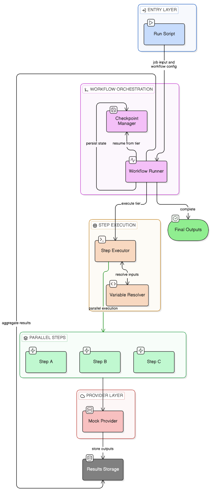
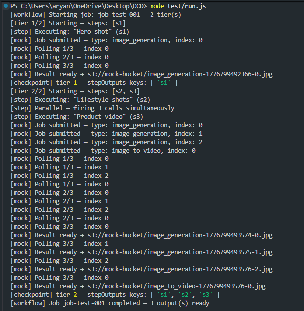
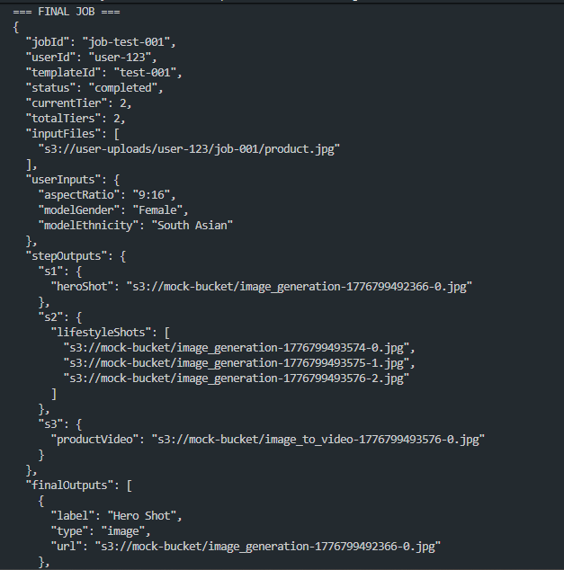
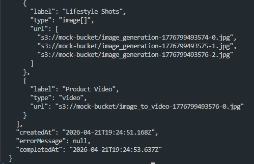

# OCD Backend Engine — AI Workflow Runner

**OneClickDesigner · Phase 2 · Backend Intern Task**

---

## The Problem

Most AI-powered SaaS products start the same way: a developer writes custom backend code for every feature. Template A gets its own route, its own API calls, its own logic. Template B gets another. This works at two templates. It falls apart at twenty.

**OneClickDesigner faced exactly this.** Each video template — hero shot, lifestyle photos, product video — required a separate implementation. Adding a new template meant a backend deployment. Changing a step meant touching code. Testing meant re-running the whole pipeline.

The solution is a **JSON-driven workflow engine**: a single generic backend that reads a template's configuration and executes it. No new code per template. No deployments for new creative workflows. A designer writes JSON, the engine runs it.

This is the same architectural pattern powering **n8n**, **Zapier**, and **ComfyUI** — and it's what this engine implements.

---

## How to Run

```bash
node test/run.js
```

No dependencies. No `.env` file. No setup beyond cloning. Pure Node.js built-ins only.

---

## Architecture

The system follows a layered architecture where each component has a single responsibility, ensuring modularity and scalability.

<p align="center">
  
</p>

<p align="center">
  <i>Figure: Layered architecture of the workflow execution engine</i>
</p>


## Bug Fix Case Study

---

### Bug 1 — Off-by-one in tier status string

**The issue:**
```js
job.status = `tier_${i}_of_${executionOrder.length}`;  // i is 0-based
```
The loop index `i` starts at 0, so the first tier produces the status string `tier_0_of_2`. This is misleading in any context where status is human-readable — a monitoring dashboard, a support ticket, an ops alert.

**Why it matters in production:**
Job status strings are consumed by more than just logs. They feed dashboards, trigger webhooks, appear in customer-facing UI, and are queried by support engineers during incidents. A status of `tier_0_of_2` implies the job hasn't started, or that there's a phantom "tier zero" that never completes. At scale, with hundreds of jobs running simultaneously, this kind of silent mislabelling makes incident response significantly harder.

**The fix:**
```js
job.status = `tier_${i + 1}_of_${executionOrder.length}`;
```
Tiers are a human-facing concept. They must be 1-based.

---

### Bug 2 — Sequential for-loop masquerading as parallel execution

**The issue:**
```js
for (const stepId of tier) {
  const result = await executeStep(stepDef, job);  // waits for each step before starting the next
  results.push(result);
}
```
A `for...of` loop with `await` inside is always sequential. Step 2 cannot start until step 1 resolves. This is the most critical bug because it undermines the entire architectural premise of the engine.

**Why it matters in production:**
Real AI providers (Runway, Kling, Freepik) take 20–60 seconds per call. In Tier 2, steps `s2` and `s3` have no dependency on each other — they can run simultaneously. With a sequential loop, a tier that should take 40 seconds takes 80. At scale, this doubles processing time and halves throughput for every job in the queue. Customers wait longer, servers stay occupied longer, and costs increase proportionally.

**The fix:**
```js
const results = await Promise.all(
  tier.map(stepId => {
    const stepDef = steps.find(s => s.stepId === stepId);
    return executeStep(stepDef, job).then(result => ({ stepId, result }));
  })
);
```
`Promise.all` fires all step promises simultaneously and waits for all to resolve. The console output proves it — `s2` and `s3` both log their submission at the same timestamp.

---

### Bug 3 — Wiping `stepOutputs` after job completion

**The issue:**
```js
job.finalOutputs = outputSchema.map(o => { ... });
job.status = 'completed';
job.stepOutputs = {};  // data destroyed here
```
`stepOutputs` is cleared to an empty object immediately after `finalOutputs` is built from it. The bug is silent in simple test runs because `finalOutputs` is already populated — but the damage is already done.

**Why it matters in production:**
This bug has two blast radii. First, any downstream system that receives the completed job object — an audit logger, a billing service, a retry handler — sees empty `stepOutputs` and cannot reconstruct what ran. Second, and more critically, this engine's crash recovery model (see below) depends entirely on `stepOutputs` being persisted after every tier. If a crashed job is reloaded and its `stepOutputs` is empty, the resume logic concludes that nothing has run and restarts from tier 1 — re-invoking every completed AI API call and billing the platform again.

**The fix:**
The line is simply removed. `stepOutputs` must remain intact for the lifetime of the job.

---

## Resume-From-Tier: Fault Tolerance at the Tier Level

### What it is

After every tier completes, the engine calls `saveCheckpoint(job)`. In production, this writes the full `job` object — including all `stepOutputs` accumulated so far — to a persistent store (Redis, DynamoDB, PostgreSQL).

If the server crashes mid-job, the job is not lost. It can be reloaded from the last checkpoint and resumed from the next tier. Steps that already completed are not re-executed.

### The implementation

```js
const alreadyDone = tier.every(stepId => job.stepOutputs.hasOwnProperty(stepId));
if (alreadyDone) {
  console.log(`[tier ${i + 1}] Skipping — already completed (resume mode)`);
  continue;
}
```

Before executing any tier, the runner checks whether all of that tier's steps already have entries in `stepOutputs`. If they do, the tier is skipped entirely and execution continues to the next one.

### Why this matters

Consider a four-tier job where each tier costs $0.50 in AI API credits:

```
Tier 1 ──► completed, checkpointed
Tier 2 ──► completed, checkpointed
Tier 3 ──► SERVER CRASH
Tier 4 ──► never ran
```

**Without resume-from-tier:** The job restarts from Tier 1. $1.00 already spent is wasted. The user waits for the full job duration again.

**With resume-from-tier:** The job reloads at Tier 3. Tiers 1 and 2 are skipped instantly. The user waits only for the remaining work.

At production volume — hundreds of jobs per day, AI calls costing real money — this is not an optimisation. It is a requirement. It is also the difference between a backend that is merely functional and one that is fault-tolerant.

### How checkpoints and resume interact

```
Job loads from DB
      │
      ▼
  Tier 1 ──► stepOutputs has 's1'? YES ──► skip
      │
      ▼
  Tier 2 ──► stepOutputs has 's2', 's3'? YES ──► skip
      │
      ▼
  Tier 3 ──► stepOutputs has 's4'? NO ──► execute
      │
      ▼
  saveCheckpoint()
      │
      ▼
  Tier 4 ──► execute
```

The resume logic is pure, stateless, and requires no additional configuration. The `stepOutputs` object is the source of truth.

---

## Visual Documentation

**Console Output** — a screenshot of the actual `node test/run.js` output, with `s2` and `s3` submission lines highlighted to prove simultaneous execution:







---


